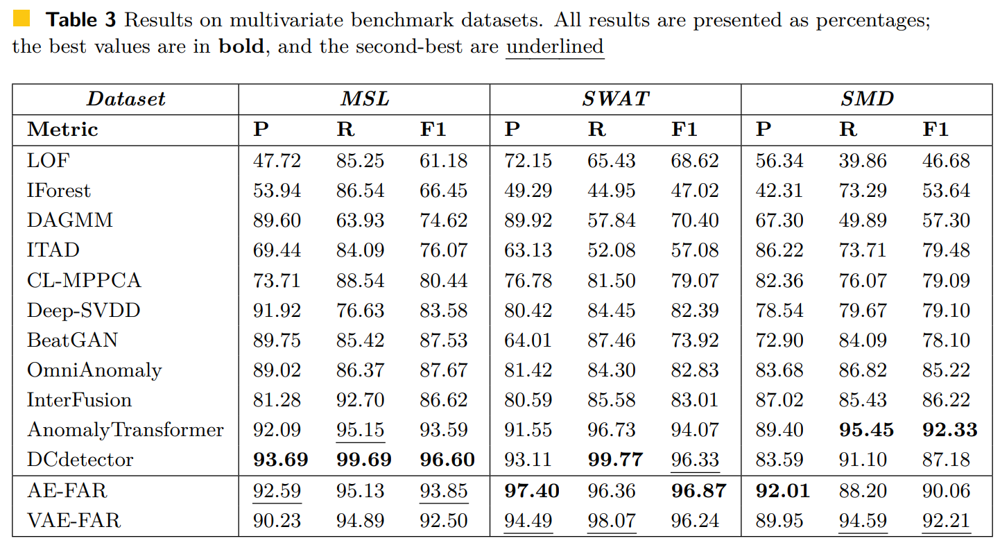

# Time Series Anomaly Detection Leveraging MSE Feedback with AutoEncoder and RNN

The CompositeModel architecture (named as **AE-FAR** or **VAE-FAR**) includes a combination of an Autoencoder (AE) or Variational Autoencoder (VAE) and MSE Feedback with Attention and RNN(FAR). This architecture leverages error feedback to enhance model performance through a two-phase training process.

## Training Phases
The training is structured in two main phases:

- Pretraining Phase: The AE or VAE is trained independently to learn a compressed representation of the input data. This pretraining establishes a robust initialization for the CompositeModel.

- CompositeModel Training Phase (AE-FAR/VAE-FAR): The pretrained AE or VAE model is integrated into the CompositeModel with the FAR module. This phase refines the model to incorporate error feedback, enhancing its predictive capability.

# Main Results
Performance comparison of different anomaly detection methods in the literature.

# Description

- models folder contain pretrained models for proposed AE-FAR
- train-model.ipynb  for training code
- test-model.ipynb to evaluate the model with pretrained weights
